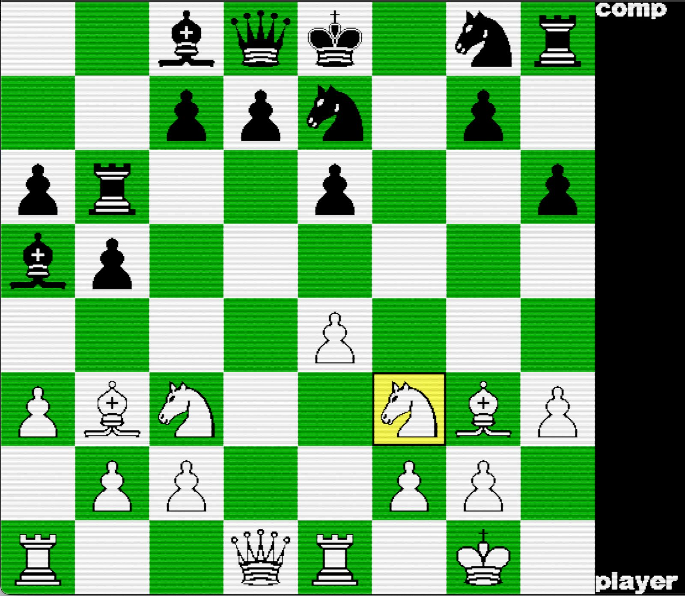
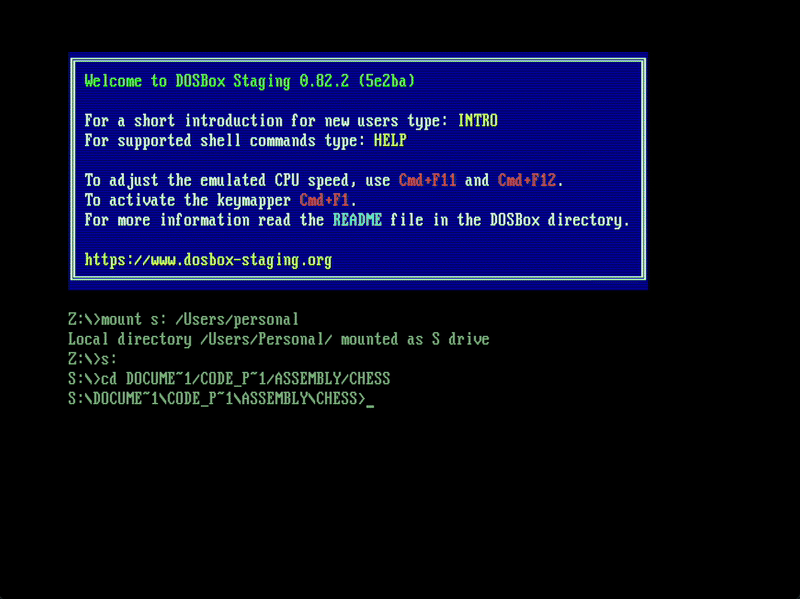
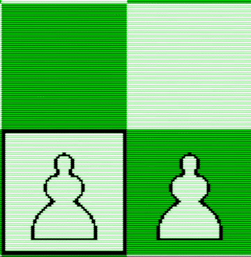
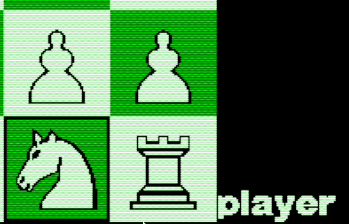

# Chess in x86 Assembly
With AI. In real-mode DOS. For some reason.

Chess written entirely in **x86 assembly**!

Includes:

- Pixel-by-pixel rendered graphics
- Rotating playing modes
- Minimax AI opponent with [alpha–beta pruning](https://en.wikipedia.org/wiki/Alpha%E2%80%93beta_pruning)

---

## How to Run

### Requirements

- A DOS emulator (classic DOSBox works)
- TASM + TLINK (included in the repo)

### Setup & Build

    mount s /PATH/TO/ASSEMBLY-CHESS
    s:
    cd CHESS
    path ../TASM
    tasm chess.asm
    tlink chess.obj
    chess

---

## How to Play

- Move the cursor using **W / A / S / D**
- Press **Space** to select a piece
- Move to a destination square
- Press **Space** again to place the piece

### Player Configuration

- By default:
  - **White** → Player
  - **Black** → Computer
- Move the cursor beyond the right edge of the board to cycle control assigments
- Player vs. Player or Comp vs. Comp assignments are possible

---

## About the AI

The AI is implemented using the classic Minimax, along with alpha–beta pruning for a faster performance.
The deafult search depth is 4 moves ahead, but it is possible to adjust it via a constant near the top of the source file.

---

## About the Graphics

All visuals are rendered manually at the pixel level.

My process:
1. Scraped LiChess for images of this particular chess set
2. Ran a simple Python script to convert each image into 1s and 0s based on color thresholds
3. Applied some manual tweaks
4. Embedded the final bit results directly into the assembly source

---

## Notes

- This is my own personal project, everything was coded by me alone
- Everything runs in real mode
- No external libraries were used